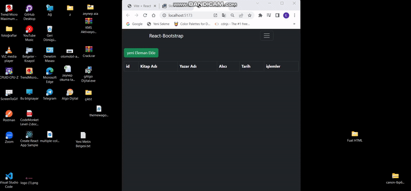

# toolkit-crudpage

# vite ile proje

Kurulumu,

# -npx create-react-app . yerine

# -npx create vite@latest

oluşturduktan sonra
-cd klasör ismi
-npm i
-npm start yerine npm run dev
-gelen linke tıkla

#Redux Toolkit
-reduxa göre çok daha az kod içeriyor.
-Gömülü middleware mevcut
-extra işlem yapmadan thunku kullanabiliyoruz.
-Devtools eklentisi sayesinde store daha rahat izlenebiliyor
-veri yönetiimi daha kolay olacak

# # Kurulumu

-gerekli kütüphaneleri indirelim
*i redux
*react-redux
@reduxjs/toolkit

-app>store js
-store.js oluştur

- - `createStore` yerine `configureStore` kullanılacak
- - store export et
- - store main js projeye tanıt

- - reducer ,action dosyası,

-slice oluştur(hem reducerları hem action 'ları kapsar )
-yönerge `counterSlice.js` içerisinde
-sonrasında mainjs içerisinde store Provider ile tanıttık

# Crud projesi

-Edit içerisinde izlenecek yol:
-Modal içerisine düzenlenecek olan elemanın bütütn verileri aktarılır
-Modal inputlarınının içerisine eğer düzenlenicek eleman varsa onun değerleri girilir yoksa boş bırakılır.

